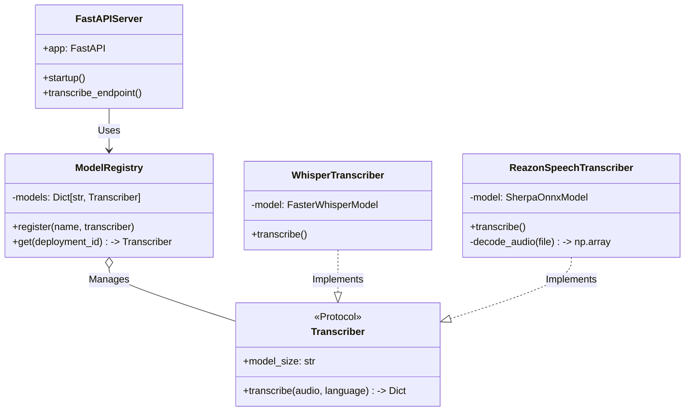
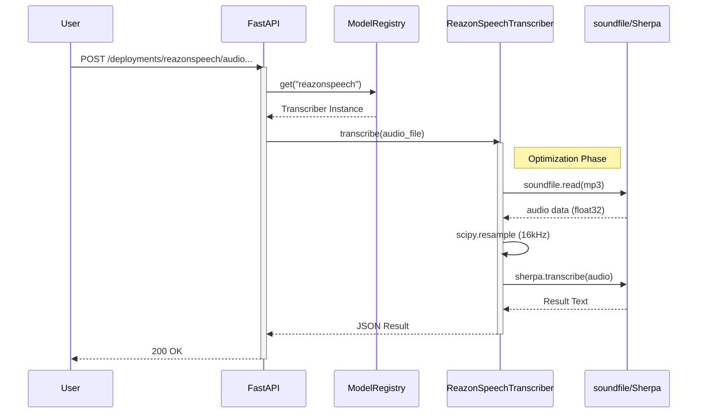

# System Architecture

## 1. 前提条件とスコープ (Constraints & Scope)

### 前提環境 (Constraints)
- **OS**: Windows 10/11 (Native, Process-heavy optimizations)
- **Runtime**: Python 3.10+
- **Hardware**: CPU (AVX2/AVX-512) priority. GPU (CUDA) optional.
- **Performance**:
    - **ReazonSpeech**: soundfileによる高速デコード (RTF < 0.1)
    - **Kotoba-Whisper**: INT8量子化による高精度推論
- **Constraint**: Windowsにおけるサブプロセス起動オーバーヘッド回避のため、ネイティブライブラリ (`soundfile`, `scipy`) を優先利用する。

### スコープ (Scope)
- **対象領域**: Azure OpenAI Service (Whisper) 互換のREST API。
- **提供機能**: マルチモデル音声認識、モデル切り替え、ヘルスチェック。

---

## 2. 静的設計 (Static Design)

### コンポーネント構成 (Component Diagram)

### ファイル構成
| ファイル | 役割 |
|---|---|
| `app/main.py` | FastAPIサーバー定義、エンドポイント実装 |
| `app/model_registry.py` | モデル管理、エイリアス解決、`Transcriber` Protocol定義 |
| `app/transcriber.py` | `Kotoba-Whisper` (faster-whisper) の実装 |
| `app/reazonspeech_transcriber.py` | `ReazonSpeech` (Sherpa-ONNX) の実装 (soundfile最適化済) |
| `run.ps1` | サーバー起動スクリプト (環境チェック含む) |
| `setup.ps1` | 初期セットアップスクリプト |

---

## 3. 動的設計 (Dynamic Design)

### リクエストフロー (Sequence Diagram)

---

## 4. 最適化戦略 (Optimization Strategy)

### ReazonSpeechの高速化
Windows環境における `subprocess` (FFmpeg) の起動オーバーヘッド (約1.2秒/回) を回避するため、以下の戦略を採用しています。

1.  **ネイティブデコード**:
    - `soundfile` (libsndfile) を使用してMP3/WAVを直接メモリに読み込む。
    - これによりデコード時間を ~20ms に短縮 (MP3 44.1kHz -> 16kHz PCM)。
    - `pydub` (FFmpeg wrapper) はフォールバックとしてのみ使用。

2.  **常駐型モデルロード**:
    - サーバー起動時にモデルをメモリにロードし、リクエスト毎のロード時間をゼロにする。

3.  **ライブラリ選定**:
    - `Sherpa-ONNX` (Next-gen Kaldi) バックエンドによる軽量高速推論。
    - `faster-whisper` (CTranslate2) による高精度モデルのINT8量子化実行。
