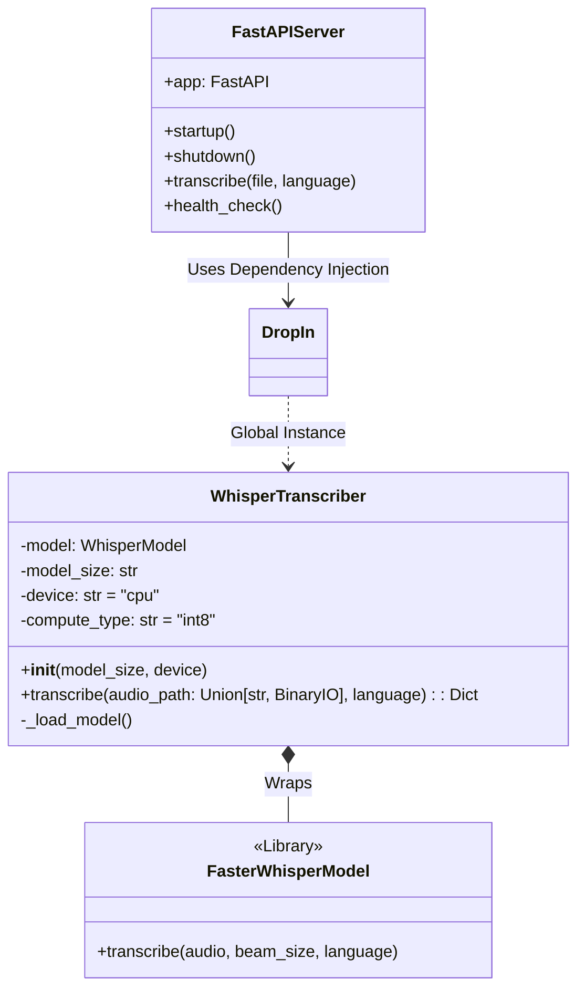
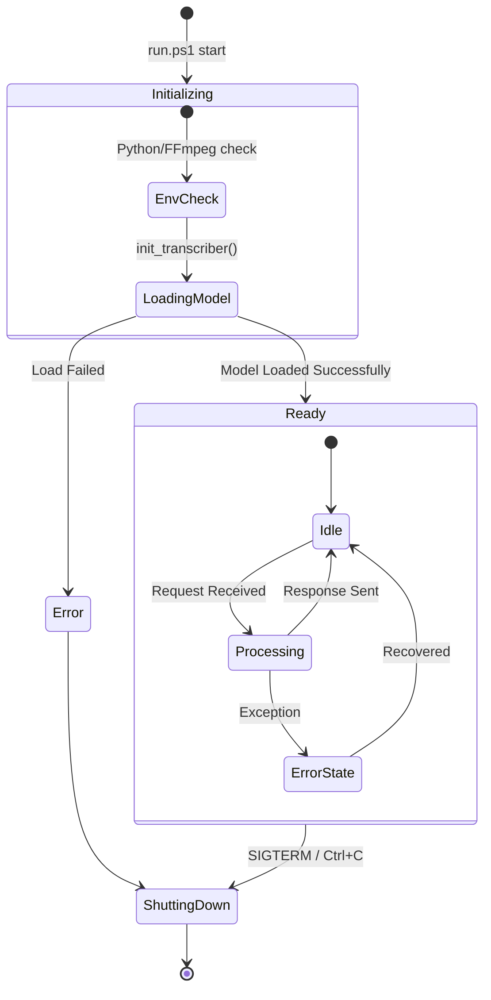
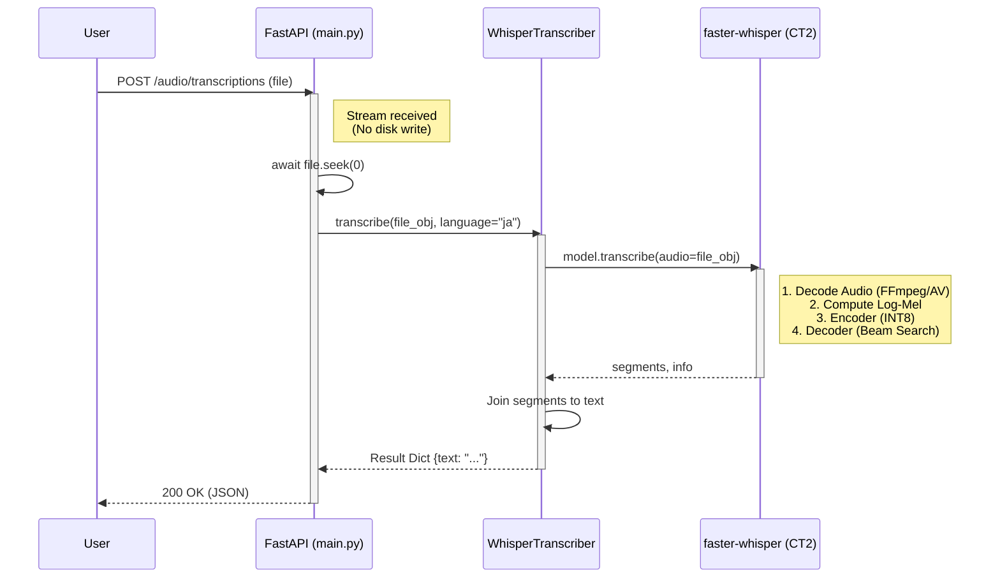

# System Architecture

## 1. 前提条件とスコープ (Constraints & Scope)

### 前提環境 (Constraints)
- **OS**: Windows 11 (Native環境)
- **Hardware**: AMD Ryzen 7 7840HS w/ Radeon 780M Graphics & Ryzen AI
- **Runtime**: Python 3.11+
- **Performance Requirement**: 実用速度での日本語音声認識 (RTF < 1.0)
- **Technical Constraint**: 
    - AMD GPU (DirectML) はFP32での推論に制限され、INT8量子化の恩恵を受けにくい。
    - Ryzen AI (NPU) は環境構築難易度が高く、現状は実験的機能にとどまる。
    - そのため、**CPU (AVX-512/AMX) + INT8量子化** を採用する。

### スコープ (Scope)
- **対象領域**: Azure OpenAI Service (Whisperモデル) 互換のREST APIサーバー。
- **提供機能**: 音声ファイル (mp3, wav等) を受け取り、テキスト化してJSONで返す。
- **対象外**: 学習(Fine-tuning)、音声合成(TTS)、リアルタイムストリーミング(WebSocket)。

---

## 2. 静的設計 (Static Design)

システムの構成要素（登場人物）と構造定義。

### 登場人物 (Components)

| コンポーネント | 役割 | 実装ファイル |
|---|---|---|
| **API Server (FastAPI)** | HTTPリクエストの受付、バリデーション、レスポンス生成。 | `app/main.py` |
| **Transcriber Wrapper** | 推論エンジンの抽象化レイヤー。スレッドセーフなモデル管理。 | `app/transcriber.py` |
| **Inference Engine** | 実際の推論処理 (`faster-whisper` / `CTranslate2`)。 | External Lib |
| **Model Registry** | モデル重みファイル (`model_cache/`)。 | File System |

### クラス図 (Class Diagram)

### オブジェクト図 (Runtime Structure)
実行時のメモリ上のオブジェクト構成。
- **Singleton**: `WhisperTranscriber` はサーバー起動時に1つだけ生成され、全リクエストで共有される。

---

## 3. 動的設計 (Dynamic Design)

システムの状態変化とライフサイクル。

### 状態遷移図 (State Transition Diagram)

サーバープロセスのライフサイクルを示します。

---

## 4. 機能設計 (Functional Design)

処理の流れとデータフロー。

### プロセスフロー (Process Flow)
ユーザーのリクエストがどのように処理されるか。

1. **Upload**: ユーザーが音声ファイルをPOST。
2. **Stream Handling**: FastAPIがファイルをメモリ上 (`SpooledTemporaryFile`) にバッファリング。
3. **Dispatch**: コントローラーが `transcriber.transcribe` を呼び出し、ファイルポインタを渡す。
4. **Decoding**: `faster-whisper` (pyav) がバイナリストリームから音声波形をデコード。
5. **Inference**: モデルがEncoder-Decoder処理を実行 (in CPU INT8)。
6. **Response**: テキスト生成結果を含むJSONを返却。

### シーケンス図 (Sequence Diagram)

「文字起こしリクエスト」の詳細フロー。

